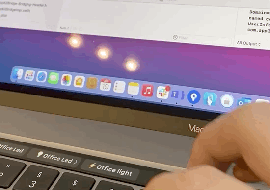

# ios2mac

Small demonstration of communication between macOS and iOS specific code in macCatalist app.
This example uses AppKit and HomeKit at the same time.

Full description of project setup can be found in my medium post: https://erik-hric.medium.com/use-of-macos-specific-api-in-maccatalyst-apps-and-vice-versa-e7082a007b7c

This simple workaround allows you to create macOS apps like this:

## No licence
feel free to copy and use in your project
